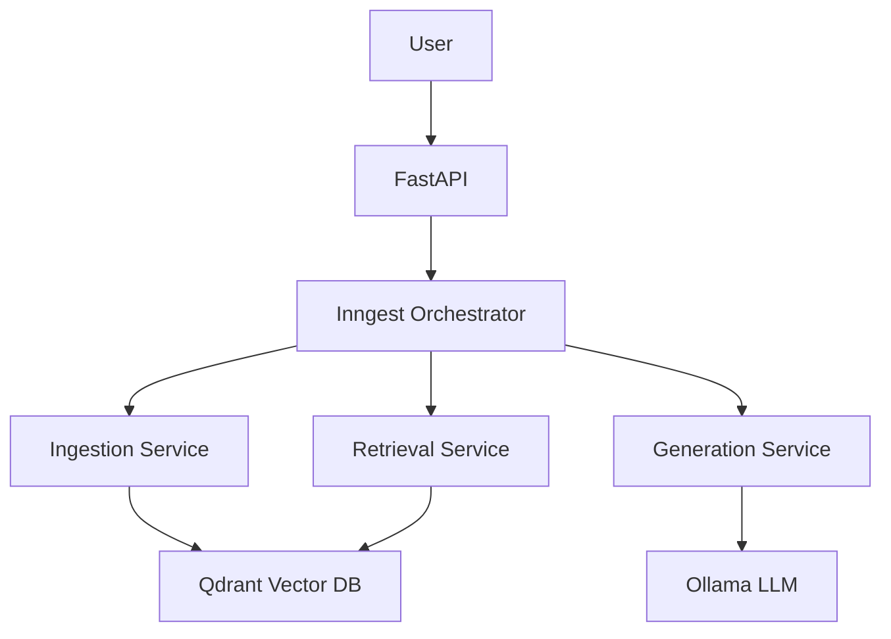

# Production-Grade RAG System Recipe

**A comprehensive blueprint for building enterprise-tier Retrieval-Augmented Generation systems**

> **Use this recipe before writing any code.** This guide ensures you build production-ready, scalable, and maintainable RAG systems from day one.

---

## Table of Contents

1. [Pre-Development Planning](#pre-development-planning)
2. [Architecture & Engineering Practices](#architecture--engineering-practices)
3. [Technology Stack Selection](#technology-stack-selection)
4. [Production Readiness](#production-readiness)
5. [Scalability & Reliability](#scalability--reliability)
6. [DevOps & Infrastructure](#devops--infrastructure)
7. [Documentation & Maintainability](#documentation--maintainability)
8. [Operational Maturity](#operational-maturity)
9. [Security & Compliance](#security--compliance)
10. [Testing & Quality Assurance](#testing--quality-assurance)
11. [Monitoring & Observability](#monitoring--observability)
12. [Cost Optimization](#cost-optimization)

---

## Pre-Development Planning

### 1. Requirements Gathering

**Before writing code, define:**

- [ ] **Use Cases**: What problems are you solving?
- [ ] **User Personas**: Who will use this system?
- [ ] **Document Types**: PDFs, markdown, HTML, databases, APIs?
- [ ] **Query Patterns**: Simple Q&A, complex reasoning, multi-hop?
- [ ] **Scale Expectations**: 
  - Documents: How many? How large?
  - Users: Concurrent users? Queries per second?
  - Data Growth: Expected growth rate?
- [ ] **Latency Requirements**: 
  - Ingestion: Real-time vs batch?
  - Query: Sub-second? Seconds? Minutes acceptable?
- [ ] **Accuracy Requirements**: 
  - Precision/Recall targets?
  - Hallucination tolerance?
  - Source attribution requirements?
- [ ] **Budget Constraints**: 
  - Infrastructure costs?
  - API costs (if using external LLMs)?
  - Storage costs?

### 2. Architecture Decision Records (ADRs)

**Document key decisions before implementation:**

- [ ] Vector Database choice (Qdrant, Pinecone, Weaviate, ChromaDB, etc.)
- [ ] Embedding model (OpenAI, Cohere, local models, etc.)
- [ ] LLM choice (OpenAI, Anthropic, local models, etc.)
- [ ] Orchestration framework (Inngest, Temporal, Airflow, etc.)
- [ ] API framework (FastAPI, Flask, Django, etc.)
- [ ] Deployment strategy (Docker, Kubernetes, serverless, etc.)

**Template for ADR:**
```markdown
## ADR-001: Vector Database Selection

**Status**: Accepted
**Context**: Need persistent, scalable vector storage
**Decision**: Use Qdrant
**Consequences**:
  - Pros: Self-hosted, open-source, production-ready
  - Cons: Requires infrastructure management
  - Alternatives considered: Pinecone (managed but costly), ChromaDB (simpler but less scalable)
```

### 3. Project Structure Planning

**Establish clear structure from day one:**

```
project/
├── src/
│   ├── api/              # API endpoints
│   ├── core/             # Core business logic
│   ├── ingestion/        # Document processing
│   ├── retrieval/        # Vector search
│   ├── generation/       # LLM integration
│   ├── models/           # Data models (Pydantic)
│   └── utils/            # Utilities
├── tests/
│   ├── unit/
│   ├── integration/
│   └── e2e/
├── infrastructure/
│   ├── docker/
│   ├── kubernetes/
│   └── terraform/
├── docs/
│   ├── architecture/
│   ├── api/
│   └── deployment/
├── scripts/
│   ├── setup/
│   └── migration/
├── .github/
│   └── workflows/        # CI/CD
├── docker-compose.yml
├── pyproject.toml        # Modern Python dependency management
└── README.md
```

---

## Architecture & Engineering Practices

### 1. Multi-Service Architecture

**Design for microservices from the start:**

- [ ] **Separation of Concerns**:
  - Ingestion Service: Document processing pipeline
  - Retrieval Service: Vector search operations
  - Generation Service: LLM interactions
  - API Gateway: Request routing and authentication
  - Orchestration Service: Workflow management

- [ ] **Service Communication**:
  - Use message queues (RabbitMQ, Redis, Kafka) for async operations
  - REST APIs for synchronous operations
  - Event-driven architecture for decoupling

- [ ] **Data Flow Design**:
  ```
  User Request → API Gateway → Orchestrator → [Ingestion/Retrieval/Generation] → Response
  ```

### 2. Type Safety & Data Validation

**Use Pydantic models throughout:**

```python
# ✅ Good: Type-safe models
from pydantic import BaseModel, Field
from typing import List, Optional
from datetime import datetime

class DocumentChunk(BaseModel):
    id: str = Field(..., description="Unique chunk identifier")
    content: str = Field(..., min_length=1)
    source_id: str
    metadata: dict = Field(default_factory=dict)
    embedding: Optional[List[float]] = None
    created_at: datetime = Field(default_factory=datetime.utcnow)

class QueryRequest(BaseModel):
    question: str = Field(..., min_length=1, max_length=1000)
    top_k: int = Field(default=5, ge=1, le=50)
    score_threshold: float = Field(default=0.0, ge=0.0, le=1.0)
    filters: Optional[dict] = None
```

**Benefits:**
- Automatic validation
- IDE autocomplete
- API documentation generation
- Runtime type checking

### 3. Error Handling & Resilience

**Implement comprehensive error handling:**

```python
# ✅ Good: Structured error handling
from enum import Enum
from typing import Optional

class RAGErrorCode(str, Enum):
    INGESTION_FAILED = "INGESTION_FAILED"
    EMBEDDING_FAILED = "EMBEDDING_FAILED"
    VECTOR_SEARCH_FAILED = "VECTOR_SEARCH_FAILED"
    LLM_GENERATION_FAILED = "LLM_GENERATION_FAILED"
    RATE_LIMIT_EXCEEDED = "RATE_LIMIT_EXCEEDED"

class RAGException(Exception):
    def __init__(
        self,
        code: RAGErrorCode,
        message: str,
        details: Optional[dict] = None,
        retryable: bool = False
    ):
        self.code = code
        self.message = message
        self.details = details or {}
        self.retryable = retryable
        super().__init__(self.message)
```

**Error Handling Checklist:**
- [ ] Retry logic for transient failures
- [ ] Circuit breakers for external services
- [ ] Graceful degradation (fallback responses)
- [ ] Structured logging with error context
- [ ] Error tracking (Sentry, Datadog, etc.)

### 4. Configuration Management

**Use environment-based configuration:**

```python
# ✅ Good: Environment-based config
from pydantic_settings import BaseSettings
from typing import Optional

class Settings(BaseSettings):
    # Vector Database
    qdrant_url: str = "http://localhost:6333"
    qdrant_collection: str = "documents"
    vector_dimension: int = 768
    
    # Embedding Model
    embedding_model: str = "nomic-embed-text"
    embedding_provider: str = "ollama"  # ollama, openai, cohere
    
    # LLM
    llm_model: str = "gemma3:1b"
    llm_provider: str = "ollama"
    llm_temperature: float = 0.2
    llm_max_tokens: int = 1024
    
    # Rate Limiting
    rate_limit_per_minute: int = 60
    rate_limit_per_hour: int = 1000
    
    # Orchestration
    inngest_api_base: str = "http://localhost:8288/v1"
    
    class Config:
        env_file = ".env"
        env_file_encoding = "utf-8"
        case_sensitive = False

settings = Settings()
```

**Configuration Best Practices:**
- [ ] Never hardcode values
- [ ] Use `.env` files for local development
- [ ] Use secrets management (AWS Secrets Manager, HashiCorp Vault) for production
- [ ] Validate configuration on startup
- [ ] Support multiple environments (dev, staging, prod)

### 5. Code Organization

**Follow clean architecture principles:**

- [ ] **Domain Layer**: Core business logic (independent of frameworks)
- [ ] **Application Layer**: Use cases and orchestration
- [ ] **Infrastructure Layer**: External services (DB, APIs, etc.)
- [ ] **Presentation Layer**: API endpoints, UI

**Dependency Rule**: Inner layers don't know about outer layers

```
presentation → application → domain ← infrastructure
```

---

## Technology Stack Selection

### 1. Vector Database

**Evaluation Criteria:**
- Scalability (millions of vectors)
- Performance (query latency)
- Persistence (data durability)
- Cost (self-hosted vs managed)
- Features (filtering, metadata, etc.)

**Options:**

| Database | Type | Best For | Considerations |
|----------|------|----------|----------------|
| **Qdrant** | Self-hosted | Production, cost-sensitive | Requires infrastructure |
| **Pinecone** | Managed | Quick setup, scaling | Cost at scale |
| **Weaviate** | Self-hosted/Managed | GraphQL, ML features | Learning curve |
| **ChromaDB** | Self-hosted | Simple, local dev | Limited scalability |
| **Milvus** | Self-hosted | Large scale, distributed | Complex setup |

**Recommendation**: Qdrant for production (balance of features, cost, performance)

### 2. Embedding Models

**Evaluation Criteria:**
- Embedding dimensions (affects storage/performance)
- Accuracy (semantic understanding)
- Speed (throughput)
- Cost (API vs local)
- Multilingual support

**Options:**

| Model | Dimensions | Provider | Best For |
|-------|------------|----------|----------|
| **OpenAI text-embedding-3** | 1536 | OpenAI API | High accuracy, English |
| **Cohere embed-english-v3** | 1024 | Cohere API | Multilingual, accuracy |
| **nomic-embed-text** | 768 | Ollama (local) | Cost-effective, privacy |
| **all-MiniLM-L6-v2** | 384 | Sentence Transformers | Fast, local, smaller |
| **BGE-large-en-v1.5** | 1024 | HuggingFace | High accuracy, local |

**Recommendation**: 
- **Production**: OpenAI/Cohere for accuracy
- **Cost-sensitive**: nomic-embed-text (Ollama) for local deployment

### 3. LLM Selection

**Evaluation Criteria:**
- Context window size
- Response quality
- Latency
- Cost (per token)
- Privacy (local vs API)

**Options:**

| Model | Provider | Context | Best For |
|-------|----------|---------|----------|
| **GPT-4** | OpenAI | 128k | Highest quality |
| **Claude 3** | Anthropic | 200k | Long context, reasoning |
| **Gemini Pro** | Google | 32k | Multimodal, cost-effective |
| **Llama 3** | Meta (local) | 8k+ | Privacy, cost control |
| **gemma3:1b** | Ollama (local) | 8k | Fast, lightweight |

**Recommendation**: 
- **Production**: Claude 3 or GPT-4 for quality
- **Cost-sensitive**: Local models (Llama 3, gemma3) via Ollama

### 4. Orchestration Framework

**Why orchestration matters:**
- Retry failed operations
- Rate limiting and throttling
- Step-by-step execution tracking
- Workflow visualization
- Error recovery

**Options:**

| Framework | Type | Best For |
|-----------|------|----------|
| **Inngest** | Cloud/self-hosted | Modern apps, TypeScript/Python |
| **Temporal** | Self-hosted | Complex workflows, reliability |
| **Airflow** | Self-hosted | Data pipelines, scheduling |
| **Prefect** | Cloud/self-hosted | Modern data workflows |

**Recommendation**: Inngest for RAG systems (simple, modern, good DX)

### 5. API Framework

**FastAPI is recommended:**
- Automatic OpenAPI documentation
- Type validation with Pydantic
- Async support
- High performance
- Easy testing

### 6. Package Management

**Use modern Python tooling:**

- [ ] **`uv`** for fast dependency management (replaces pip)
- [ ] **`pyproject.toml`** for project configuration (replaces setup.py)
- [ ] **Poetry** or **PDM** as alternatives

**Example `pyproject.toml`:**
```toml
[project]
name = "rag-production-app"
version = "0.1.0"
requires-python = ">=3.11"
dependencies = [
    "fastapi>=0.116.1",
    "inngest>=0.5.6",
    "qdrant-client>=1.15.1",
    "pydantic>=2.0.0",
    "pydantic-settings>=2.0.0",
]

[project.optional-dependencies]
dev = [
    "pytest>=7.4.0",
    "pytest-asyncio>=0.21.0",
    "black>=23.0.0",
    "ruff>=0.1.0",
    "mypy>=1.5.0",
]
```

---

## Production Readiness

### 1. Rate Limiting & Throttling

**Implement at multiple levels:**

```python
# ✅ Good: Multi-level rate limiting
from inngest import RateLimit
import datetime

# Per-source rate limiting (prevent duplicate ingestions)
@inngest_client.create_function(
    fn_id="ingest_pdf",
    rate_limit=RateLimit(
        limit=1,
        period=datetime.timedelta(hours=4),
        key="event.data.source_id",  # Per document
    ),
)

# Global throttling (prevent system overload)
@inngest_client.create_function(
    fn_id="ingest_pdf",
    throttle=inngest.Throttle(
        limit=2,
        period=datetime.timedelta(minutes=1),
    ),
)
```

**Rate Limiting Checklist:**
- [ ] Per-user rate limits (API level)
- [ ] Per-source rate limits (ingestion)
- [ ] Global throttling (system protection)
- [ ] Configurable limits (environment-based)
- [ ] Rate limit headers in responses
- [ ] Graceful error messages when limits exceeded

### 2. Retry Logic & Circuit Breakers

**Handle transient failures:**

```python
# ✅ Good: Retry with exponential backoff
from tenacity import retry, stop_after_attempt, wait_exponential

@retry(
    stop=stop_after_attempt(3),
    wait=wait_exponential(multiplier=1, min=2, max=10)
)
async def embed_text_with_retry(text: str) -> List[float]:
    """Embed text with automatic retry on failure."""
    try:
        return await ollama_client.embeddings(model=EMBED_MODEL, prompt=text)
    except Exception as e:
        logger.error(f"Embedding failed: {e}")
        raise
```

**Circuit Breaker Pattern:**
```python
from circuitbreaker import circuit

@circuit(failure_threshold=5, recovery_timeout=60)
async def call_external_api():
    """Prevent cascading failures."""
    # API call
    pass
```

### 3. Data Validation & Sanitization

**Validate all inputs:**

- [ ] Document size limits (prevent memory issues)
- [ ] File type validation (whitelist allowed types)
- [ ] Content sanitization (prevent injection attacks)
- [ ] Query validation (length, content checks)
- [ ] Metadata validation (prevent schema violations)

### 4. Security Best Practices

**Security Checklist:**
- [ ] Authentication & Authorization (JWT, OAuth2)
- [ ] API key management (rotate regularly)
- [ ] Input sanitization (prevent injection)
- [ ] Secrets management (never commit secrets)
- [ ] HTTPS only (TLS/SSL)
- [ ] CORS configuration (restrict origins)
- [ ] Rate limiting (prevent abuse)
- [ ] Audit logging (track all operations)

### 5. Health Checks & Readiness Probes

**Implement comprehensive health checks:**

```python
# ✅ Good: Health check endpoint
from fastapi import FastAPI
from pydantic import BaseModel

class HealthStatus(BaseModel):
    status: str
    services: dict

@app.get("/health")
async def health_check() -> HealthStatus:
    """Check system health."""
    services = {
        "qdrant": await check_qdrant(),
        "ollama": await check_ollama(),
        "inngest": await check_inngest(),
    }
    status = "healthy" if all(services.values()) else "degraded"
    return HealthStatus(status=status, services=services)
```

---

## Scalability & Reliability

### 1. Horizontal Scaling

**Design for scale from day one:**

- [ ] **Stateless Services**: No server-side session storage
- [ ] **Load Balancing**: Multiple instances behind load balancer
- [ ] **Database Sharding**: Distribute vector data across shards
- [ ] **Caching**: Redis for frequently accessed data
- [ ] **CDN**: Serve static assets via CDN

### 2. Data Persistence

**Ensure data durability:**

- [ ] **Vector Database**: Persistent storage (not in-memory)
- [ ] **Backups**: Regular automated backups
- [ ] **Replication**: Multi-region replication for HA
- [ ] **Versioning**: Track document versions
- [ ] **Migration Strategy**: Plan for schema changes

### 3. Performance Optimization

**Optimize for speed:**

- [ ] **Batch Processing**: Process multiple embeddings at once
- [ ] **Async Operations**: Use async/await throughout
- [ ] **Connection Pooling**: Reuse database connections
- [ ] **Caching**: Cache frequent queries
- [ ] **Indexing**: Proper vector index configuration (HNSW, IVF)
- [ ] **Chunking Strategy**: Optimal chunk size and overlap

### 4. Fault Tolerance

**Handle failures gracefully:**

- [ ] **Graceful Degradation**: Return partial results if possible
- [ ] **Fallback Responses**: Default answers when LLM fails
- [ ] **Dead Letter Queues**: Store failed messages for retry
- [ ] **Monitoring**: Alert on failures
- [ ] **Auto-recovery**: Automatic retry with backoff

### 5. Capacity Planning

**Plan for growth:**

- [ ] **Load Testing**: Test with expected load
- [ ] **Stress Testing**: Find breaking points
- [ ] **Resource Monitoring**: Track CPU, memory, disk usage
- [ ] **Scaling Triggers**: Auto-scale based on metrics
- [ ] **Cost Projections**: Estimate costs at scale

---

## DevOps & Infrastructure

### 1. Containerization

**Dockerize everything:**

```dockerfile
# ✅ Good: Multi-stage Dockerfile
FROM python:3.11-slim as builder

WORKDIR /app

# Install uv for fast package management
RUN pip install --no-cache-dir uv

# Copy dependency files
COPY pyproject.toml uv.lock* ./

# Install dependencies
RUN uv sync --frozen

# Production stage
FROM python:3.11-slim

WORKDIR /app

# Copy virtual environment from builder
COPY --from=builder /app/.venv /app/.venv

# Copy application code
COPY . .

# Use venv Python
ENV PATH="/app/.venv/bin:$PATH"

# Health check
HEALTHCHECK --interval=30s --timeout=10s --start-period=40s \
  CMD curl -f http://localhost:8000/health || exit 1

CMD ["uvicorn", "main:app", "--host", "0.0.0.0", "--port", "8000"]
```

**Docker Best Practices:**
- [ ] Multi-stage builds (smaller images)
- [ ] Layer caching (faster rebuilds)
- [ ] Non-root user (security)
- [ ] Health checks (monitoring)
- [ ] .dockerignore (exclude unnecessary files)

### 2. Docker Compose

**Orchestrate local development:**

```yaml
# ✅ Good: Complete docker-compose.yml
version: '3.8'

services:
  qdrant:
    image: qdrant/qdrant:latest
    ports:
      - "6333:6333"
    volumes:
      - qdrant_storage:/qdrant/storage
    healthcheck:
      test: ["CMD", "curl", "-f", "http://localhost:6333/health"]
      interval: 10s
      timeout: 5s
      retries: 5

  ollama:
    build:
      context: .
      dockerfile: Dockerfile.ollama
    ports:
      - "11435:11435"
    volumes:
      - ollama_data:/root/.ollama
    healthcheck:
      test: ["CMD", "curl", "-f", "http://localhost:11435/api/tags"]
      interval: 10s
      timeout: 5s
      retries: 10
      start_period: 60s

  api:
    build: .
    ports:
      - "8000:8000"
    environment:
      - QDRANT_URL=http://qdrant:6333
      - OLLAMA_BASE_URL=http://ollama:11435
    depends_on:
      qdrant:
        condition: service_healthy
      ollama:
        condition: service_healthy
    healthcheck:
      test: ["CMD", "curl", "-f", "http://localhost:8000/health"]
      interval: 10s
      timeout: 5s
      retries: 5

volumes:
  qdrant_storage:
  ollama_data:
```

### 3. CI/CD Pipeline

**Automate testing and deployment:**

```yaml
# ✅ Good: GitHub Actions workflow
name: CI/CD Pipeline

on:
  push:
    branches: [main, develop]
  pull_request:
    branches: [main]

jobs:
  test:
    runs-on: ubuntu-latest
    steps:
      - uses: actions/checkout@v3
      - uses: actions/setup-python@v4
        with:
          python-version: '3.11'
      - name: Install uv
        run: pip install uv
      - name: Install dependencies
        run: uv sync
      - name: Run linters
        run: uv run ruff check . && uv run mypy .
      - name: Run tests
        run: uv run pytest

  build:
    needs: test
    runs-on: ubuntu-latest
    steps:
      - uses: actions/checkout@v3
      - name: Build Docker image
        run: docker build -t rag-app:${{ github.sha }} .
      - name: Push to registry
        run: |
          echo "${{ secrets.DOCKER_PASSWORD }}" | docker login -u "${{ secrets.DOCKER_USERNAME }}" --password-stdin
          docker push rag-app:${{ github.sha }}
```

**CI/CD Checklist:**
- [ ] Automated testing (unit, integration, e2e)
- [ ] Code quality checks (linters, type checkers)
- [ ] Security scanning (dependencies, containers)
- [ ] Automated builds (Docker images)
- [ ] Deployment automation (staging, production)
- [ ] Rollback strategy

### 4. Infrastructure as Code

**Use IaC for reproducibility:**

- [ ] **Terraform** or **Pulumi** for cloud infrastructure
- [ ] **Kubernetes** manifests for orchestration
- [ ] **Helm charts** for package management
- [ ] **Ansible** for configuration management

### 5. Environment Management

**Separate environments:**

- [ ] **Development**: Local Docker Compose
- [ ] **Staging**: Production-like environment
- [ ] **Production**: Live system
- [ ] Environment-specific configuration
- [ ] Secrets management per environment

---

## Documentation & Maintainability

### 1. Code Documentation

**Document everything:**

```python
# ✅ Good: Comprehensive docstrings
def embed_texts(texts: List[str]) -> List[List[float]]:
    """
    Generate embeddings for a list of texts using Ollama.
    
    Args:
        texts: List of text strings to embed. Each text should be
            between 1 and 8192 characters.
    
    Returns:
        List of embedding vectors. Each vector is a list of 768 floats
        (for nomic-embed-text model).
    
    Raises:
        EmbeddingError: If embedding generation fails after retries.
        ValueError: If texts list is empty or contains invalid text.
    
    Example:
        >>> texts = ["Hello world", "How are you?"]
        >>> embeddings = embed_texts(texts)
        >>> len(embeddings) == 2
        True
        >>> len(embeddings[0]) == 768
        True
    """
    # Implementation
    pass
```

**Documentation Checklist:**
- [ ] Module-level docstrings
- [ ] Function/method docstrings (Google or NumPy style)
- [ ] Type hints on all functions
- [ ] Inline comments for complex logic
- [ ] README with setup instructions
- [ ] API documentation (OpenAPI/Swagger)
- [ ] Architecture diagrams (Mermaid, PlantUML)
- [ ] Deployment guides
- [ ] Troubleshooting guides

### 2. README Structure

**Comprehensive README:**

```markdown
# Project Name

## Overview
Brief description of the RAG system.

## Architecture
High-level architecture diagram and explanation.

## Quick Start
1. Prerequisites
2. Installation
3. Configuration
4. Running locally

## API Documentation
Link to API docs or inline examples.

## Development
- Setup instructions
- Running tests
- Code style guidelines
- Contributing guidelines

## Deployment
- Docker deployment
- Kubernetes deployment
- Environment variables
- Secrets management

## Monitoring
- Health checks
- Metrics endpoints
- Logging

## Troubleshooting
Common issues and solutions.
```

### 3. Architecture Documentation

**Document system design:**

- [ ] **System Architecture**: High-level component diagram
- [ ] **Data Flow**: How data moves through the system
- [ ] **Sequence Diagrams**: Request/response flows
- [ ] **Database Schema**: Vector DB structure
- [ ] **API Contracts**: Request/response formats
- [ ] **Deployment Architecture**: Infrastructure diagram

**Use Mermaid for diagrams:**


### 4. Code Quality Tools

**Enforce code quality:**

- [ ] **Black**: Code formatting
- [ ] **Ruff**: Fast linting (replaces flake8, isort)
- [ ] **mypy**: Type checking
- [ ] **pytest**: Testing framework
- [ ] **pre-commit hooks**: Run checks before commit

**Example `.pre-commit-config.yaml`:**
```yaml
repos:
  - repo: https://github.com/psf/black
    rev: 23.12.0
    hooks:
      - id: black
  - repo: https://github.com/astral-sh/ruff-pre-commit
    rev: v0.1.0
    hooks:
      - id: ruff
  - repo: https://github.com/pre-commit/mirrors-mypy
    rev: v1.7.0
    hooks:
      - id: mypy
```

---

## Operational Maturity

### 1. Logging

**Structured logging:**

```python
# ✅ Good: Structured logging
import logging
import json
from datetime import datetime

class JSONFormatter(logging.Formatter):
    def format(self, record):
        log_data = {
            "timestamp": datetime.utcnow().isoformat(),
            "level": record.levelname,
            "logger": record.name,
            "message": record.getMessage(),
            "module": record.module,
            "function": record.funcName,
            "line": record.lineno,
        }
        if hasattr(record, "extra"):
            log_data.update(record.extra)
        return json.dumps(log_data)

# Configure logger
logger = logging.getLogger("rag_app")
handler = logging.StreamHandler()
handler.setFormatter(JSONFormatter())
logger.addHandler(handler)
logger.setLevel(logging.INFO)
```

**Logging Checklist:**
- [ ] Structured logs (JSON format)
- [ ] Log levels (DEBUG, INFO, WARNING, ERROR, CRITICAL)
- [ ] Correlation IDs (track requests across services)
- [ ] Sensitive data masking (never log secrets)
- [ ] Log aggregation (ELK, Loki, CloudWatch)
- [ ] Retention policies

### 2. Monitoring & Metrics

**Track key metrics:**

- [ ] **Application Metrics**:
  - Request rate (QPS)
  - Latency (p50, p95, p99)
  - Error rate
  - Success rate
- [ ] **Business Metrics**:
  - Documents ingested per day
  - Queries per day
  - Average response time
  - User satisfaction
- [ ] **Infrastructure Metrics**:
  - CPU usage
  - Memory usage
  - Disk I/O
  - Network I/O
- [ ] **Vector DB Metrics**:
  - Collection size
  - Query latency
  - Index build time
- [ ] **LLM Metrics**:
  - Token usage
  - Generation latency
  - Cost per query

**Use Prometheus + Grafana:**
```python
from prometheus_client import Counter, Histogram, Gauge

# Define metrics
requests_total = Counter('rag_requests_total', 'Total requests')
request_duration = Histogram('rag_request_duration_seconds', 'Request duration')
active_ingestions = Gauge('rag_active_ingestions', 'Active ingestion jobs')
```

### 3. Alerting

**Set up alerts for:**

- [ ] High error rate (> 5%)
- [ ] High latency (p95 > threshold)
- [ ] Service downtime
- [ ] Resource exhaustion (CPU, memory, disk)
- [ ] Rate limit violations
- [ ] Cost anomalies
- [ ] Data quality issues

### 4. Performance Monitoring

**Track performance:**

- [ ] **APM Tools**: New Relic, Datadog, AppDynamics
- [ ] **Distributed Tracing**: OpenTelemetry, Jaeger
- [ ] **Profiling**: cProfile, py-spy
- [ ] **Load Testing**: Locust, k6

### 5. Disaster Recovery

**Plan for failures:**

- [ ] **Backup Strategy**: 
  - Daily automated backups
  - Point-in-time recovery
  - Test restore procedures
- [ ] **Failover Strategy**:
  - Multi-region deployment
  - Automatic failover
  - Data replication
- [ ] **Incident Response**:
  - Runbooks for common issues
  - On-call rotation
  - Post-mortem process

---

## Security & Compliance

### 1. Authentication & Authorization

**Secure access:**

- [ ] **API Keys**: Rotate regularly
- [ ] **JWT Tokens**: For user authentication
- [ ] **OAuth2**: For third-party integrations
- [ ] **RBAC**: Role-based access control
- [ ] **API Gateway**: Centralized auth

### 2. Data Privacy

**Protect sensitive data:**

- [ ] **Data Encryption**: At rest and in transit
- [ ] **PII Handling**: Mask/redact personal information
- [ ] **Data Retention**: Automatic deletion policies
- [ ] **Access Logging**: Audit who accessed what
- [ ] **GDPR Compliance**: Right to deletion, data portability

### 3. Input Validation

**Sanitize all inputs:**

- [ ] **File Upload Validation**: Type, size, content checks
- [ ] **Query Sanitization**: Prevent injection attacks
- [ ] **Rate Limiting**: Prevent abuse
- [ ] **Content Filtering**: Block malicious content

### 4. Secrets Management

**Never commit secrets:**

- [ ] **Environment Variables**: For local development
- [ ] **Secrets Manager**: AWS Secrets Manager, HashiCorp Vault
- [ ] **Rotation**: Automatic secret rotation
- [ ] **Access Control**: Limit who can access secrets

---

## Testing & Quality Assurance

### 1. Testing Strategy

**Comprehensive testing:**

- [ ] **Unit Tests**: Test individual functions
- [ ] **Integration Tests**: Test service interactions
- [ ] **E2E Tests**: Test complete workflows
- [ ] **Load Tests**: Test under expected load
- [ ] **Chaos Tests**: Test failure scenarios

### 2. Test Coverage

**Aim for high coverage:**

```python
# ✅ Good: Comprehensive test example
import pytest
from unittest.mock import Mock, patch

@pytest.mark.asyncio
async def test_embed_texts_success():
    """Test successful embedding generation."""
    texts = ["Hello world"]
    with patch('ollama.Client') as mock_client:
        mock_client.embeddings.return_value = {"embedding": [0.1] * 768}
        result = await embed_texts(texts)
        assert len(result) == 1
        assert len(result[0]) == 768

@pytest.mark.asyncio
async def test_embed_texts_retry():
    """Test retry on transient failure."""
    # Test implementation
    pass
```

**Coverage Goals:**
- Unit tests: > 80% coverage
- Integration tests: Critical paths
- E2E tests: Main user flows

### 3. Test Data Management

**Manage test data:**

- [ ] **Fixtures**: Reusable test data
- [ ] **Mocking**: Mock external services
- [ ] **Test Databases**: Isolated test environments
- [ ] **Data Cleanup**: Clean up after tests

---

## Cost Optimization

### 1. Infrastructure Costs

**Optimize spending:**

- [ ] **Right-sizing**: Match resources to workload
- [ ] **Reserved Instances**: For predictable workloads
- [ ] **Auto-scaling**: Scale down during low usage
- [ ] **Spot Instances**: For non-critical workloads
- [ ] **Storage Optimization**: Compress, archive old data

### 2. API Costs

**Minimize external API usage:**

- [ ] **Caching**: Cache frequent queries
- [ ] **Local Models**: Use Ollama for cost savings
- [ ] **Batch Processing**: Reduce API calls
- [ ] **Token Optimization**: Shorter prompts, fewer tokens
- [ ] **Cost Monitoring**: Track and alert on spending

### 3. Vector DB Costs

**Optimize storage:**

- [ ] **Index Tuning**: Balance speed vs memory
- [ ] **Data Lifecycle**: Archive/delete old data
- [ ] **Compression**: Reduce storage footprint
- [ ] **Sharding**: Distribute load efficiently

---

## Pre-Launch Checklist

**Before going to production:**

### Code Quality
- [ ] All tests passing
- [ ] Code reviewed and approved
- [ ] Linters and type checkers passing
- [ ] No security vulnerabilities
- [ ] Documentation complete

### Infrastructure
- [ ] Infrastructure provisioned
- [ ] Secrets configured
- [ ] Monitoring set up
- [ ] Alerts configured
- [ ] Backups enabled

### Performance
- [ ] Load testing completed
- [ ] Performance benchmarks met
- [ ] Capacity planning done
- [ ] Scaling configured

### Security
- [ ] Security audit completed
- [ ] Authentication/authorization tested
- [ ] Input validation verified
- [ ] Secrets management verified

### Operations
- [ ] Runbooks created
- [ ] On-call rotation set up
- [ ] Incident response plan ready
- [ ] Rollback procedure tested

---

## Conclusion

**This recipe ensures you build production-grade RAG systems from day one.**

**Key Takeaways:**
1. **Plan before coding**: Requirements, architecture, tech stack
2. **Type safety**: Use Pydantic, type hints throughout
3. **Orchestration**: Use Inngest or similar for reliability
4. **Containerization**: Dockerize everything
5. **Monitoring**: Log, metric, and alert on everything
6. **Documentation**: Document as you build
7. **Testing**: Test early and often
8. **Security**: Security from the start, not an afterthought

**Remember**: Production-grade systems are built incrementally. Start with the basics (type safety, error handling, logging) and add complexity (orchestration, monitoring, scaling) as needed.

---

## Additional Resources

- [FastAPI Documentation](https://fastapi.tiangolo.com/)
- [Inngest Documentation](https://www.inngest.com/docs)
- [Qdrant Documentation](https://qdrant.tech/documentation/)
- [Pydantic Documentation](https://docs.pydantic.dev/)
- [Docker Best Practices](https://docs.docker.com/develop/dev-best-practices/)

---

**Last Updated**: 2025-01-XX  
**Version**: 1.0.0  
**Maintainer**: [Your Name/Team]

