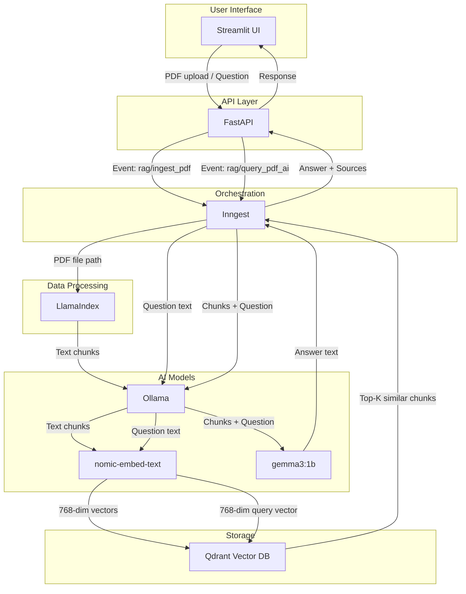
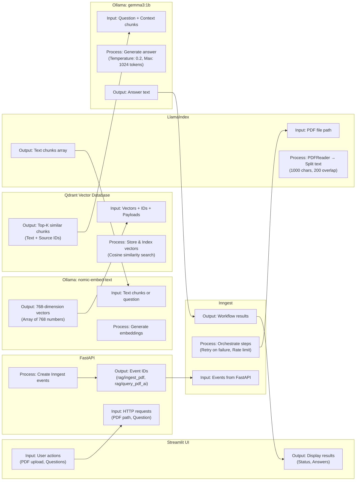
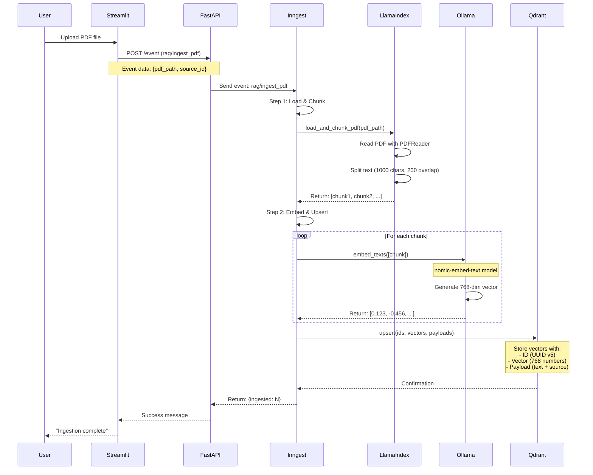
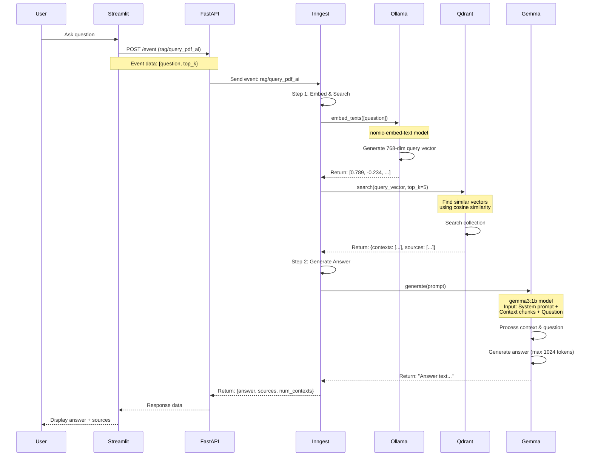
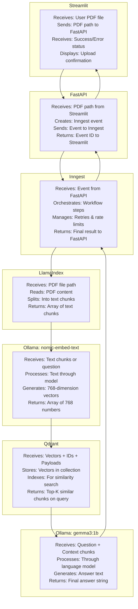

# RAG Pipeline Flow

## Core Components

**FastAPI** - Backend API that receives requests from Streamlit and triggers workflows.

**Inngest** - Manages workflow steps. Handles retries if tasks fail and limits how many tasks run at once.

**Qdrant** - Stores document embeddings (768 numbers per chunk) for fast search.

**Ollama** - Runs AI models locally:
- `nomic-embed-text`: Converts text into 768-number vectors
- `gemma3:1b`: Answers questions using retrieved document chunks

**LlamaIndex** - Reads PDFs and splits them into chunks (1000 characters each, 200 overlap).

**Streamlit** - Web interface for uploading PDFs and asking questions.

## Component Interactions

### Component Input/Output Diagram

### Component Details

## Workflow Diagrams

### PDF Upload & Ingestion Flow

### Question Answering Flow

## Data Flow Visualization

### What Each Component Does

## Workflow Summary

### Document Ingestion
1. User uploads PDF via Streamlit
2. FastAPI sends event to Inngest
3. Inngest workflow:
   - Reads PDF and splits into chunks
   - Converts chunks to embeddings using nomic-embed-text
   - Saves embeddings to Qdrant

### Question Answering
1. User asks a question via Streamlit
2. FastAPI sends event to Inngest
3. Inngest workflow:
   - Converts question to embedding
   - Searches Qdrant for similar chunks
   - Sends chunks + question to gemma3:1b
   - Returns answer with source documents

## Performance

**gemma3:1b Speed**: ~2,585 tokens/second on modern hardware

**Memory**: ~1.5GB VRAM (BF16) or ~1.1GB (SFP8)

**Embedding Dimensions**: 768 per chunk

**Chunk Size**: 1000 characters with 200 character overlap
